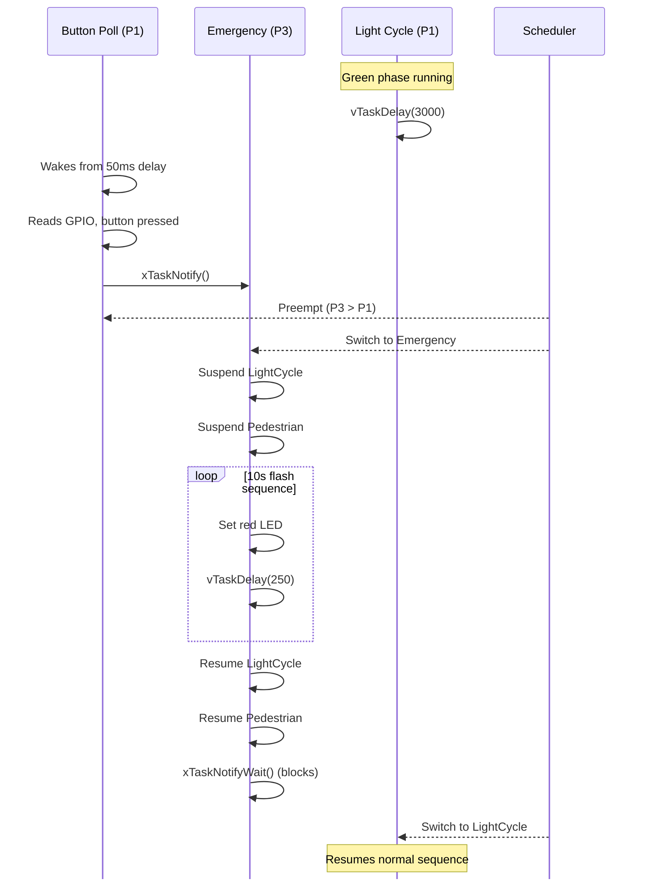

import TawkWidget from '../../../../components/TawkWidget.astro';
import UniversalContentContributors from '../../../../components/UniversalContentContributors.astro';
import InArticleAd from '../../../../components/InArticleAd.astro';
import Copyright from '../../../../components/Copyright.astro';
import BionicText from '../../../../components/BionicText.astro';
import TailwindWrapper from '../../../../components/TailwindWrapper.jsx';
import { Tabs, TabItem } from '@astrojs/starlight/components';
import { Card, CardGrid, Badge, Steps, LinkButton, FileTree } from '@astrojs/starlight/components';

<UniversalContentContributors 
  contributors={frontmatter.contributors}
/>


import RtosProgrammingComments from '../../../../components/rtos-programming/RtosProgrammingComments.astro';

A traffic light seems simple until you need it to handle a pedestrian pressing a crossing button while an emergency vehicle demands immediate green. Suddenly you need tasks that can preempt each other, priorities that determine who runs first, and a scheduler that switches context in microseconds. In this lesson you will build exactly that: a three-task traffic light controller on FreeRTOS where the light cycle, pedestrian request, and emergency override each run at different priorities, giving you a hands-on view of task states, preemption, and context switching. #FreeRTOS #TaskScheduling #ContextSwitch

## What We Are Building

<Card title="Priority-Based Traffic Light Controller" icon="star">
Three FreeRTOS tasks manage a set of traffic LEDs. The lowest-priority task runs the normal red, yellow, green cycle. A medium-priority task listens for a pedestrian button press and interrupts the cycle to allow crossing. The highest-priority task monitors an emergency button and forces all lights to flashing red. Each priority level demonstrates preemptive scheduling in action.
</Card>

**Project specifications:**

| Parameter | Value |
|-----------|-------|
| MCU | STM32 Blue Pill or ESP32 DevKit |
| RTOS | FreeRTOS |
| Tasks | 3 (light cycle, pedestrian, emergency) |
| Priority levels | Low (1), Medium (2), High (3) |
| LEDs | Red, Yellow, Green (traffic signals) |
| Buttons | Pedestrian request, Emergency override |
| Scheduler | Priority-based preemptive with time slicing |
| Stack per task | 256 words (configurable) |

### Parts List

| Ref | Component | Quantity | Notes |
|-----|-----------|----------|-------|
| U1 | STM32 Blue Pill or ESP32 DevKit | 1 | Reuse from prior courses |
| D1 | Red LED | 1 | Traffic stop signal |
| D2 | Yellow LED | 1 | Traffic caution signal |
| D3 | Green LED | 1 | Traffic go signal |
| R1, R2, R3 | 330 ohm resistor | 3 | LED current limiters |
| SW1 | Tactile push button | 1 | Pedestrian request |
| SW2 | Tactile push button | 1 | Emergency override |
| - | Breadboard and jumper wires | 1 set | For prototyping |

## Task States in FreeRTOS

<InArticleAd />


Every FreeRTOS task exists in one of four states at any given moment. Understanding these states is essential for predicting how the scheduler will behave and for debugging tasks that seem stuck or unresponsive.

### The Four States

**Ready:** The task is able to run but is not currently executing because a higher-priority (or equal-priority) task holds the CPU. Ready tasks sit in a priority-ordered list, waiting for the scheduler to select them.

**Running:** The task currently has the CPU. On a single-core MCU like the STM32F103, exactly one task is in the Running state at any time.

**Blocked:** The task is waiting for an event. This could be a time delay (`vTaskDelay`), a queue receive, a semaphore take, or a task notification wait. Blocked tasks consume zero CPU cycles. They automatically move to the Ready state when the event they are waiting for occurs or their timeout expires.

**Suspended:** The task has been explicitly removed from scheduling by a call to `vTaskSuspend()`. It will not run, and no timeout will wake it. Only an explicit call to `vTaskResume()` (or `xTaskResumeFromISR()` from an interrupt) moves it back to Ready.

```text
  FreeRTOS Task State Machine
  ────────────────────────────────────────
              vTaskResume()
       ┌─────────────────────┐
       │                     ▼
  ┌────────────┐       ┌───────────┐
  │ SUSPENDED  │       │   READY   │◄──────────┐
  └────────────┘       └─────┬─────┘           │
       ▲                     │ scheduler        │
       │ vTaskSuspend()      │ selects          │
       │                     ▼                  │
  ┌────────────┐       ┌───────────┐   preempted│
  │  BLOCKED   │◄──────│  RUNNING  │───────────►│
  │ (waiting   │ block │ (on CPU)  │
  │  for event)│ API   └───────────┘
  └────────────┘
       │ event occurs
       └──────────────────────►READY
```

### State Transitions

| From | To | Triggered By |
|------|----|-------------|
| Ready | Running | Scheduler selects this task (highest priority in Ready list) |
| Running | Ready | A higher-priority task becomes Ready (preemption), or time slice expires for equal-priority tasks |
| Running | Blocked | Task calls a blocking API: `vTaskDelay()`, `xQueueReceive()`, `xSemaphoreTake()`, etc. |
| Running | Suspended | Task calls `vTaskSuspend(NULL)` on itself, or another task calls `vTaskSuspend(handle)` |
| Blocked | Ready | Blocking event occurs (data arrives in queue, delay expires, semaphore given) |
| Blocked | Suspended | Another task calls `vTaskSuspend(handle)` while this task is blocked |
| Suspended | Ready | Another task calls `vTaskResume(handle)` or ISR calls `xTaskResumeFromISR(handle)` |

:::note[No direct Suspended to Running]
A suspended task always transitions to Ready first, then the scheduler decides whether it should run based on priority.
:::

## Task Control Block (TCB)

<InArticleAd />


FreeRTOS maintains an internal structure for each task called the Task Control Block (TCB). You do not access this structure directly in application code, but understanding its contents helps you reason about memory usage and debug task-related issues.

Each TCB stores the following:

| Field | Purpose |
|-------|---------|
| Stack pointer | Points to the current top of the task's stack (updated on every context switch) |
| Priority | The task's current priority level (may be temporarily elevated by priority inheritance) |
| State | Which list the task belongs to (Ready, Blocked, Suspended) |
| Task name | A string identifier used for debugging and trace output |
| Stack base | The starting address of the allocated stack memory |
| Stack high water mark | The smallest amount of remaining stack space ever recorded |
| Event list item | Links the task into event wait lists (queues, semaphores) |
| Notification value | A 32-bit value for lightweight task notifications |

### Why Stack Allocation Matters

Every task gets its own stack, allocated either from the FreeRTOS heap (dynamic) or from a statically declared array. If a task's stack is too small, local variables and nested function calls will overflow into adjacent memory, corrupting other tasks or kernel data structures. There is no MMU on Cortex-M3 to catch this, so stack overflow often causes silent data corruption that manifests as seemingly random crashes.

A 256-word (1024-byte) stack is a reasonable starting point for most simple tasks. Tasks that use `printf`, `snprintf`, or deep call chains may need 512 words or more. Always verify with the stack high water mark during development.

## Priority-Based Preemptive Scheduling

<InArticleAd />


FreeRTOS uses a priority-based preemptive scheduler by default. The rule is straightforward: the highest-priority task in the Ready state always gets the CPU. If a higher-priority task becomes Ready while a lower-priority task is Running, the scheduler immediately preempts the lower-priority task and gives the CPU to the higher-priority one.

This preemption happens at any point in the lower-priority task's code. The lower-priority task does not need to yield or reach a blocking call. The scheduler interrupts it, saves its context, and switches to the new task.

The idle task is a special task created automatically by FreeRTOS at priority 0 (the lowest possible priority). It runs whenever no other task is Ready. The idle task handles cleanup of deleted tasks and can optionally enter low-power sleep via the idle hook.

```c
/* FreeRTOSConfig.h: enable preemption */
#define configUSE_PREEMPTION    1
#define configMAX_PRIORITIES    5
```

```text
  Priority-Based Preemptive Scheduling
  ─────────────────────────────────────
  Priority 3 │ Emergency ░░░░▓▓▓▓▓▓░░░░░░░░░
  Priority 2 │ Pedestrian ░░░░░░░░░░░░▓▓░░░░░
  Priority 1 │ LightCycle ▓▓▓▓░░░░░░░░░░▓▓▓▓▓
  Priority 0 │ Idle       ░░░░░░░░░░░░░░░░░░░
             └────────────────────────────────►
              ▓ = Running   ░ = Ready/Blocked
```

With the traffic light controller, this means:
- The emergency task (priority 3) will always preempt both other tasks immediately
- The pedestrian task (priority 2) will preempt the light cycle task (priority 1)
- The light cycle task (priority 1) runs only when both higher-priority tasks are blocked

## Time Slicing

<InArticleAd />


When two or more tasks share the same priority and are both in the Ready state, FreeRTOS uses time slicing to share the CPU between them. Each task runs for one tick period (typically 1 ms), then the scheduler rotates to the next equal-priority Ready task in round-robin fashion.

Time slicing is controlled by a configuration macro:

```c
#define configUSE_TIME_SLICING    1   /* 1 = enabled (default) */
```

```text
  Round-Robin Time Slicing (equal priority)
  ──────────────────────────────────────────
  Tick   1ms  1ms  1ms  1ms  1ms  1ms
         ┌────┬────┬────┬────┬────┬────┐
  Task A │ ▓▓ │    │ ▓▓ │    │ ▓▓ │    │
  Task B │    │ ▓▓ │    │ ▓▓ │    │ ▓▓ │
         └────┴────┴────┴────┴────┴────┘
  Both at same priority: scheduler
  alternates every tick (1 ms slice).
```

When enabled, the tick interrupt (SysTick on Cortex-M) checks at every tick whether another task of the same priority is Ready. If so, a context switch occurs. If disabled, a running task will continue until it blocks or is preempted by a higher-priority task, even if equal-priority tasks are Ready.

In our traffic light project, all three tasks have different priorities, so time slicing does not come into play. However, if you added a second priority-1 task (say, a status logging task), it would share time with the light cycle task in 1 ms slices.

## Context Switch Mechanics

<InArticleAd />


A context switch is the process of saving one task's CPU state and restoring another's. On ARM Cortex-M processors, the mechanism works as follows:

<Steps>
1. A trigger event occurs: a tick interrupt (SysTick) fires, or a task calls a blocking API, or a higher-priority task becomes Ready.

2. The running code sets the PendSV (Pendable Service Call) exception to pending. PendSV runs at the lowest exception priority, ensuring it does not interrupt other ISRs.

3. When PendSV executes, it saves the current task's registers (R4 through R11, plus the link register) onto the current task's stack. The hardware has already saved R0 through R3, R12, LR, PC, and xPSR as part of the exception entry sequence.

4. The scheduler selects the next task to run by examining the Ready lists from highest priority to lowest.

5. PendSV loads the new task's saved registers from its stack, updates the stack pointer, and returns from exception. The hardware restores the remaining registers automatically.
</Steps>

The entire process takes approximately 5 to 15 microseconds on the STM32F103 at 72 MHz. This overhead is negligible for most applications, but it becomes relevant if you are switching thousands of times per second or have very tight timing requirements.

```
SysTick fires (every 1 ms)
  |
  v
xPortSysTickHandler()
  -> Increment tick count
  -> Check if any blocked tasks should unblock
  -> If context switch needed, set PendSV pending
  |
  v
PendSV_Handler (runs at lowest exception priority)
  -> Save R4-R11 to current task stack
  -> Store stack pointer in current TCB
  -> Call vTaskSwitchContext() to select next task
  -> Load stack pointer from new TCB
  -> Restore R4-R11 from new task stack
  -> Return from exception (hardware restores R0-R3, PC, etc.)
```

:::tip[Why PendSV instead of SysTick directly?]
SysTick may interrupt other ISRs. Performing a context switch inside SysTick would delay those ISRs. PendSV runs at the lowest exception priority, so it only executes after all other pending interrupts have been serviced. This keeps ISR latency predictable.
:::

## Stack Allocation

<InArticleAd />


### Static vs Dynamic Allocation

FreeRTOS supports two approaches to stack allocation:

**Dynamic allocation** (default): `xTaskCreate()` allocates the task's stack and TCB from the FreeRTOS heap. This is simpler to use but means the total memory available depends on `configTOTAL_HEAP_SIZE`.

```c
/* Dynamic: FreeRTOS allocates 256 words from its heap */
xTaskCreate(vLightCycleTask, "Light", 256, NULL, 1, NULL);
```

**Static allocation**: `xTaskCreateStatic()` uses arrays you provide at compile time. This eliminates heap fragmentation and makes memory usage fully deterministic.

```c
/* Static: you provide the stack and TCB memory */
static StackType_t light_stack[256];
static StaticTask_t light_tcb;

xTaskCreateStatic(vLightCycleTask, "Light", 256,
                  NULL, 1, light_stack, &light_tcb);
```

To enable static allocation, set `configSUPPORT_STATIC_ALLOCATION` to 1 in `FreeRTOSConfig.h`.

### Stack Size Estimation

Start with 256 words (1024 bytes) for simple tasks. Add more if the task uses `snprintf`, floating-point math, or deep call chains. During development, use `uxTaskGetStackHighWaterMark()` to check how close a task has come to overflowing:

```c
UBaseType_t remaining = uxTaskGetStackHighWaterMark(NULL);
/* Returns the minimum free stack (in words) since the task started.
   If this returns less than ~20 words, increase the stack size. */
```

### Stack Overflow Detection

Enable overflow checking in `FreeRTOSConfig.h`:

```c
#define configCHECK_FOR_STACK_OVERFLOW    2
```

Method 1 (`configCHECK_FOR_STACK_OVERFLOW = 1`) checks whether the stack pointer has moved beyond the stack boundary when a context switch occurs. Method 2 (value 2) additionally fills the stack with a known pattern (0xA5) at creation time and checks whether the last 16 bytes have been overwritten. Method 2 catches more overflows but adds a small amount of overhead to each context switch.

When an overflow is detected, FreeRTOS calls `vApplicationStackOverflowHook()`:

```c
void vApplicationStackOverflowHook(TaskHandle_t xTask, char *pcTaskName) {
    (void)xTask;
    /* Log or halt; pcTaskName tells you which task overflowed */
    uart_send_string("Stack overflow: ");
    uart_send_string(pcTaskName);
    uart_send_string("\r\n");
    __disable_irq();
    while (1);
}
```

## Circuit Connections

<InArticleAd />


<Tabs>
<TabItem label="STM32 Blue Pill">

| Signal | GPIO Pin | Connection |
|--------|----------|------------|
| Red LED | PA0 | PA0 -> 330 ohm -> Red LED anode -> GND |
| Yellow LED | PA1 | PA1 -> 330 ohm -> Yellow LED anode -> GND |
| Green LED | PA2 | PA2 -> 330 ohm -> Green LED anode -> GND |
| Pedestrian Button | PB0 | PB0 -> Button -> GND (internal pull-up enabled) |
| Emergency Button | PB1 | PB1 -> Button -> GND (internal pull-up enabled) |
| Serial TX | PA9 | To USB-serial adapter RX |
| Serial RX | PA10 | To USB-serial adapter TX |
| GND | GND | Common ground with all components |

:::note[Button wiring]
Both buttons connect the GPIO pin to GND when pressed. The firmware enables internal pull-up resistors, so no external resistors are needed. A pressed button reads as logic LOW (0).
:::

</TabItem>
<TabItem label="ESP32 DevKit">

| Signal | GPIO Pin | Connection |
|--------|----------|------------|
| Red LED | GPIO 16 | GPIO 16 -> 330 ohm -> Red LED anode -> GND |
| Yellow LED | GPIO 17 | GPIO 17 -> 330 ohm -> Yellow LED anode -> GND |
| Green LED | GPIO 18 | GPIO 18 -> 330 ohm -> Green LED anode -> GND |
| Pedestrian Button | GPIO 25 | GPIO 25 -> Button -> GND (internal pull-up enabled) |
| Emergency Button | GPIO 26 | GPIO 26 -> Button -> GND (internal pull-up enabled) |
| Serial | USB | Built-in USB-serial on DevKit |
| GND | GND | Common ground with all components |

:::note[ESP32 GPIO selection]
Avoid GPIO 6 through 11 (connected to SPI flash) and GPIO 34 through 39 (input only, no pull-up). The pins chosen here are safe for general-purpose output and input with pull-ups.
:::

</TabItem>
</Tabs>

## Complete Traffic Light Controller

<InArticleAd />


The firmware creates three tasks at different priorities. Each task manages its own aspect of the traffic light behavior. Task notifications are used for button events because they are faster and use less RAM than semaphores (no separate handle needed).

### FreeRTOSConfig.h

```c
#ifndef FREERTOS_CONFIG_H
#define FREERTOS_CONFIG_H

/* Clock */
#define configCPU_CLOCK_HZ              72000000
#define configSYSTICK_CLOCK_HZ          72000000

/* Scheduler */
#define configUSE_PREEMPTION            1
#define configUSE_TIME_SLICING          1
#define configMAX_PRIORITIES            5
#define configMINIMAL_STACK_SIZE        128
#define configTICK_RATE_HZ              1000

/* Memory */
#define configTOTAL_HEAP_SIZE           8192
#define configUSE_MALLOC_FAILED_HOOK    1

/* Features */
#define configUSE_MUTEXES               1
#define configUSE_COUNTING_SEMAPHORES   0
#define configUSE_TASK_NOTIFICATIONS    1
#define configUSE_TRACE_FACILITY        1
#define configUSE_IDLE_HOOK             1
#define configUSE_TICK_HOOK             0
#define configCHECK_FOR_STACK_OVERFLOW  2

/* Cortex-M interrupt priorities */
#define configKERNEL_INTERRUPT_PRIORITY         255
#define configMAX_SYSCALL_INTERRUPT_PRIORITY    191
#define configLIBRARY_KERNEL_INTERRUPT_PRIORITY 15
#define configLIBRARY_MAX_SYSCALL_INTERRUPT_PRIORITY 5

/* Map FreeRTOS handlers */
#define vPortSVCHandler    SVC_Handler
#define xPortPendSVHandler PendSV_Handler
#define xPortSysTickHandler SysTick_Handler

#endif
```

### Main Application Code

<Tabs>
<TabItem label="STM32 Blue Pill">

```c
#include "stm32f1xx.h"
#include "FreeRTOS.h"
#include "task.h"
#include <stdio.h>
#include <string.h>

/* ---------- Pin definitions ---------- */
#define LED_RED_PIN     0   /* PA0 */
#define LED_YELLOW_PIN  1   /* PA1 */
#define LED_GREEN_PIN   2   /* PA2 */
#define BTN_PED_PIN     0   /* PB0 */
#define BTN_EMRG_PIN    1   /* PB1 */

/* ---------- Task handles ---------- */
static TaskHandle_t xLightCycleHandle  = NULL;
static TaskHandle_t xPedestrianHandle  = NULL;
static TaskHandle_t xEmergencyHandle   = NULL;

/* ---------- Notification bits ---------- */
#define NOTIFY_PED_REQUEST   (1UL << 0)
#define NOTIFY_EMRG_REQUEST  (1UL << 0)

/* ---------- Traffic light state ---------- */
typedef enum {
    LIGHT_RED,
    LIGHT_YELLOW,
    LIGHT_GREEN,
    LIGHT_PED_WALK,
    LIGHT_EMRG_FLASH
} light_state_t;

static volatile light_state_t current_state = LIGHT_RED;

/* ---------- Hardware helpers ---------- */
static void gpio_init(void) {
    /* Enable clocks for GPIOA and GPIOB */
    RCC->APB2ENR |= RCC_APB2ENR_IOPAEN | RCC_APB2ENR_IOPBEN;

    /* PA0, PA1, PA2: push-pull output, 2 MHz */
    GPIOA->CRL &= ~(0xFFF);        /* Clear PA0-PA2 config */
    GPIOA->CRL |= 0x222;           /* Output 2 MHz, push-pull */

    /* PB0, PB1: input with pull-up */
    GPIOB->CRL &= ~(0xFF);         /* Clear PB0-PB1 config */
    GPIOB->CRL |= 0x88;            /* Input with pull-up/pull-down */
    GPIOB->ODR |= (1 << BTN_PED_PIN) | (1 << BTN_EMRG_PIN);  /* Pull-up */
}

static void set_leds(int red, int yellow, int green) {
    if (red)    GPIOA->BSRR = (1 << LED_RED_PIN);
    else        GPIOA->BRR  = (1 << LED_RED_PIN);

    if (yellow) GPIOA->BSRR = (1 << LED_YELLOW_PIN);
    else        GPIOA->BRR  = (1 << LED_YELLOW_PIN);

    if (green)  GPIOA->BSRR = (1 << LED_GREEN_PIN);
    else        GPIOA->BRR  = (1 << LED_GREEN_PIN);
}

static int btn_ped_pressed(void) {
    return !(GPIOB->IDR & (1 << BTN_PED_PIN));
}

static int btn_emrg_pressed(void) {
    return !(GPIOB->IDR & (1 << BTN_EMRG_PIN));
}

/* ---------- UART for logging ---------- */
static void uart_init(void) {
    RCC->APB2ENR |= RCC_APB2ENR_USART1EN;
    /* PA9 TX: AF push-pull, PA10 RX: input floating (already default) */
    GPIOA->CRH &= ~(0xFF << 4);
    GPIOA->CRH |= (0x0B << 4);    /* PA9: AF push-pull 50 MHz */
    GPIOA->CRH |= (0x04 << 8);    /* PA10: input floating */

    USART1->BRR = 72000000 / 115200;
    USART1->CR1 = USART_CR1_UE | USART_CR1_TE;
}

static void uart_send_char(char c) {
    while (!(USART1->SR & USART_SR_TXE));
    USART1->DR = c;
}

static void uart_send_string(const char *s) {
    while (*s) uart_send_char(*s++);
}

static void log_state(const char *source, const char *message) {
    char buf[80];
    TickType_t ticks = xTaskGetTickCount();
    snprintf(buf, sizeof(buf), "[%06lu ms] %s: %s\r\n",
             (unsigned long)ticks, source, message);
    uart_send_string(buf);
}

/* ---------- Light Cycle Task (Priority 1) ---------- */
static void vLightCycleTask(void *pvParams) {
    (void)pvParams;

    for (;;) {
        /* Red phase: 3 seconds */
        current_state = LIGHT_RED;
        set_leds(1, 0, 0);
        log_state("LightCycle", "RED on");
        vTaskDelay(pdMS_TO_TICKS(3000));

        /* Yellow phase: 1 second */
        current_state = LIGHT_YELLOW;
        set_leds(0, 1, 0);
        log_state("LightCycle", "YELLOW on");
        vTaskDelay(pdMS_TO_TICKS(1000));

        /* Green phase: 3 seconds */
        current_state = LIGHT_GREEN;
        set_leds(0, 0, 1);
        log_state("LightCycle", "GREEN on");
        vTaskDelay(pdMS_TO_TICKS(3000));

        /* Yellow phase before returning to red */
        current_state = LIGHT_YELLOW;
        set_leds(0, 1, 0);
        log_state("LightCycle", "YELLOW on");
        vTaskDelay(pdMS_TO_TICKS(1000));
    }
}

/* ---------- Pedestrian Task (Priority 2) ---------- */
static void vPedestrianTask(void *pvParams) {
    (void)pvParams;
    uint32_t notification_value;

    for (;;) {
        /* Wait for notification from button polling or ISR */
        xTaskNotifyWait(0, NOTIFY_PED_REQUEST, &notification_value,
                        portMAX_DELAY);

        log_state("Pedestrian", "Button pressed, requesting walk signal");

        /* Suspend the light cycle task to take control of LEDs */
        vTaskSuspend(xLightCycleHandle);

        /* Transition to pedestrian walk: flash green rapidly, then steady red */
        current_state = LIGHT_PED_WALK;

        /* Flash green 5 times to warn drivers */
        for (int i = 0; i < 5; i++) {
            set_leds(0, 0, 1);
            vTaskDelay(pdMS_TO_TICKS(150));
            set_leds(0, 0, 0);
            vTaskDelay(pdMS_TO_TICKS(150));
        }

        /* Hold red for vehicles, allowing pedestrian to cross */
        set_leds(1, 0, 0);
        log_state("Pedestrian", "WALK signal active (red for vehicles)");
        vTaskDelay(pdMS_TO_TICKS(5000));

        log_state("Pedestrian", "Walk complete, resuming normal cycle");

        /* Resume normal light cycle */
        vTaskResume(xLightCycleHandle);
    }
}

/* ---------- Emergency Task (Priority 3) ---------- */
static void vEmergencyTask(void *pvParams) {
    (void)pvParams;
    uint32_t notification_value;

    for (;;) {
        /* Wait for emergency notification */
        xTaskNotifyWait(0, NOTIFY_EMRG_REQUEST, &notification_value,
                        portMAX_DELAY);

        log_state("Emergency", "Override activated, flashing red");

        /* Suspend both lower-priority tasks */
        vTaskSuspend(xLightCycleHandle);
        vTaskSuspend(xPedestrianHandle);

        current_state = LIGHT_EMRG_FLASH;

        /* Flash all-red for 10 seconds */
        for (int i = 0; i < 20; i++) {
            set_leds(1, 0, 0);
            vTaskDelay(pdMS_TO_TICKS(250));
            set_leds(0, 0, 0);
            vTaskDelay(pdMS_TO_TICKS(250));
        }

        log_state("Emergency", "Override complete, resuming normal operation");

        /* Resume tasks in priority order */
        vTaskResume(xPedestrianHandle);
        vTaskResume(xLightCycleHandle);
    }
}

/* ---------- Button Polling Task (Priority 1) ---------- */
static void vButtonPollTask(void *pvParams) {
    (void)pvParams;
    TickType_t last_ped_press = 0;
    TickType_t last_emrg_press = 0;
    const TickType_t debounce_ticks = pdMS_TO_TICKS(300);

    for (;;) {
        TickType_t now = xTaskGetTickCount();

        if (btn_ped_pressed() && (now - last_ped_press > debounce_ticks)) {
            last_ped_press = now;
            xTaskNotify(xPedestrianHandle, NOTIFY_PED_REQUEST, eSetBits);
        }

        if (btn_emrg_pressed() && (now - last_emrg_press > debounce_ticks)) {
            last_emrg_press = now;
            xTaskNotify(xEmergencyHandle, NOTIFY_EMRG_REQUEST, eSetBits);
        }

        vTaskDelay(pdMS_TO_TICKS(50));  /* Poll every 50 ms */
    }
}

/* ---------- Hook functions ---------- */
void vApplicationIdleHook(void) {
    __WFI();
}

void vApplicationMallocFailedHook(void) {
    __disable_irq();
    while (1);
}

void vApplicationStackOverflowHook(TaskHandle_t xTask, char *pcTaskName) {
    (void)xTask;
    uart_send_string("Stack overflow: ");
    uart_send_string(pcTaskName);
    uart_send_string("\r\n");
    __disable_irq();
    while (1);
}

/* ---------- Main ---------- */
int main(void) {
    /* System clock at 72 MHz (assumed configured by startup/SystemInit) */
    gpio_init();
    uart_init();

    uart_send_string("Traffic Light Controller starting...\r\n");

    /* Create tasks */
    xTaskCreate(vLightCycleTask,  "Light",  256, NULL, 1, &xLightCycleHandle);
    xTaskCreate(vPedestrianTask,  "Ped",    256, NULL, 2, &xPedestrianHandle);
    xTaskCreate(vEmergencyTask,   "Emrg",   256, NULL, 3, &xEmergencyHandle);
    xTaskCreate(vButtonPollTask,  "BtnPoll", 128, NULL, 1, NULL);

    vTaskStartScheduler();

    /* Should never reach here */
    while (1);
}
```

</TabItem>
<TabItem label="ESP32 (ESP-IDF)">

```c
#include <stdio.h>
#include <string.h>
#include "freertos/FreeRTOS.h"
#include "freertos/task.h"
#include "driver/gpio.h"
#include "esp_log.h"

static const char *TAG = "TrafficLight";

/* ---------- Pin definitions ---------- */
#define LED_RED_PIN     GPIO_NUM_16
#define LED_YELLOW_PIN  GPIO_NUM_17
#define LED_GREEN_PIN   GPIO_NUM_18
#define BTN_PED_PIN     GPIO_NUM_25
#define BTN_EMRG_PIN    GPIO_NUM_26

/* ---------- Task handles ---------- */
static TaskHandle_t xLightCycleHandle  = NULL;
static TaskHandle_t xPedestrianHandle  = NULL;
static TaskHandle_t xEmergencyHandle   = NULL;

/* ---------- Notification bits ---------- */
#define NOTIFY_PED_REQUEST   (1UL << 0)
#define NOTIFY_EMRG_REQUEST  (1UL << 0)

/* ---------- Hardware helpers ---------- */
static void gpio_setup(void) {
    /* Configure LED outputs */
    gpio_config_t led_conf = {
        .pin_bit_mask = (1ULL << LED_RED_PIN) |
                        (1ULL << LED_YELLOW_PIN) |
                        (1ULL << LED_GREEN_PIN),
        .mode = GPIO_MODE_OUTPUT,
        .pull_up_en = GPIO_PULLUP_DISABLE,
        .pull_down_en = GPIO_PULLDOWN_DISABLE,
        .intr_type = GPIO_INTR_DISABLE,
    };
    gpio_config(&led_conf);

    /* Configure button inputs with pull-up */
    gpio_config_t btn_conf = {
        .pin_bit_mask = (1ULL << BTN_PED_PIN) |
                        (1ULL << BTN_EMRG_PIN),
        .mode = GPIO_MODE_INPUT,
        .pull_up_en = GPIO_PULLUP_ENABLE,
        .pull_down_en = GPIO_PULLDOWN_DISABLE,
        .intr_type = GPIO_INTR_DISABLE,
    };
    gpio_config(&btn_conf);
}

static void set_leds(int red, int yellow, int green) {
    gpio_set_level(LED_RED_PIN, red);
    gpio_set_level(LED_YELLOW_PIN, yellow);
    gpio_set_level(LED_GREEN_PIN, green);
}

static void log_state(const char *source, const char *message) {
    ESP_LOGI(TAG, "[%06lu ms] %s: %s",
             (unsigned long)(xTaskGetTickCount() * portTICK_PERIOD_MS),
             source, message);
}

/* ---------- Light Cycle Task (Priority 1) ---------- */
static void vLightCycleTask(void *pvParams) {
    (void)pvParams;

    for (;;) {
        set_leds(1, 0, 0);
        log_state("LightCycle", "RED on");
        vTaskDelay(pdMS_TO_TICKS(3000));

        set_leds(0, 1, 0);
        log_state("LightCycle", "YELLOW on");
        vTaskDelay(pdMS_TO_TICKS(1000));

        set_leds(0, 0, 1);
        log_state("LightCycle", "GREEN on");
        vTaskDelay(pdMS_TO_TICKS(3000));

        set_leds(0, 1, 0);
        log_state("LightCycle", "YELLOW on");
        vTaskDelay(pdMS_TO_TICKS(1000));
    }
}

/* ---------- Pedestrian Task (Priority 2) ---------- */
static void vPedestrianTask(void *pvParams) {
    (void)pvParams;
    uint32_t notification_value;

    for (;;) {
        xTaskNotifyWait(0, NOTIFY_PED_REQUEST, &notification_value,
                        portMAX_DELAY);

        log_state("Pedestrian", "Button pressed, requesting walk signal");
        vTaskSuspend(xLightCycleHandle);

        for (int i = 0; i < 5; i++) {
            set_leds(0, 0, 1);
            vTaskDelay(pdMS_TO_TICKS(150));
            set_leds(0, 0, 0);
            vTaskDelay(pdMS_TO_TICKS(150));
        }

        set_leds(1, 0, 0);
        log_state("Pedestrian", "WALK signal active (red for vehicles)");
        vTaskDelay(pdMS_TO_TICKS(5000));

        log_state("Pedestrian", "Walk complete, resuming normal cycle");
        vTaskResume(xLightCycleHandle);
    }
}

/* ---------- Emergency Task (Priority 3) ---------- */
static void vEmergencyTask(void *pvParams) {
    (void)pvParams;
    uint32_t notification_value;

    for (;;) {
        xTaskNotifyWait(0, NOTIFY_EMRG_REQUEST, &notification_value,
                        portMAX_DELAY);

        log_state("Emergency", "Override activated, flashing red");
        vTaskSuspend(xLightCycleHandle);
        vTaskSuspend(xPedestrianHandle);

        for (int i = 0; i < 20; i++) {
            set_leds(1, 0, 0);
            vTaskDelay(pdMS_TO_TICKS(250));
            set_leds(0, 0, 0);
            vTaskDelay(pdMS_TO_TICKS(250));
        }

        log_state("Emergency", "Override complete, resuming normal operation");
        vTaskResume(xPedestrianHandle);
        vTaskResume(xLightCycleHandle);
    }
}

/* ---------- Button Polling Task (Priority 1) ---------- */
static void vButtonPollTask(void *pvParams) {
    (void)pvParams;
    TickType_t last_ped_press = 0;
    TickType_t last_emrg_press = 0;
    const TickType_t debounce_ticks = pdMS_TO_TICKS(300);

    for (;;) {
        TickType_t now = xTaskGetTickCount();

        if (!gpio_get_level(BTN_PED_PIN) &&
            (now - last_ped_press > debounce_ticks)) {
            last_ped_press = now;
            xTaskNotify(xPedestrianHandle, NOTIFY_PED_REQUEST, eSetBits);
        }

        if (!gpio_get_level(BTN_EMRG_PIN) &&
            (now - last_emrg_press > debounce_ticks)) {
            last_emrg_press = now;
            xTaskNotify(xEmergencyHandle, NOTIFY_EMRG_REQUEST, eSetBits);
        }

        vTaskDelay(pdMS_TO_TICKS(50));
    }
}

/* ---------- Main ---------- */
void app_main(void) {
    gpio_setup();
    ESP_LOGI(TAG, "Traffic Light Controller starting...");

    xTaskCreate(vLightCycleTask,  "Light",  2048, NULL, 1, &xLightCycleHandle);
    xTaskCreate(vPedestrianTask,  "Ped",    2048, NULL, 2, &xPedestrianHandle);
    xTaskCreate(vEmergencyTask,   "Emrg",   2048, NULL, 3, &xEmergencyHandle);
    xTaskCreate(vButtonPollTask,  "BtnPoll", 2048, NULL, 1, NULL);
}
```

:::note[ESP32 stack sizes]
ESP32 stack sizes are specified in bytes (not words). The ESP-IDF default minimum is 2048 bytes. The ESP32 also has significantly more RAM than the STM32F103, so larger stacks are not a concern.
:::

</TabItem>
</Tabs>

## How the Preemption Works

<InArticleAd />


To solidify your understanding, let us walk through exactly what happens when the emergency button is pressed during a green light phase.

**Initial state:** The light cycle task (priority 1) is Running, executing its green phase `vTaskDelay(3000)`. The pedestrian task (priority 2) and emergency task (priority 3) are both Blocked, waiting on `xTaskNotifyWait()`. The button poll task (priority 1) is Blocked on its 50 ms delay.

<Steps>
1. The button poll task wakes from its 50 ms delay. Since it shares priority 1 with the light cycle task (which is currently Blocked in `vTaskDelay`), the button poll task enters Running state and checks the GPIO pins.

2. The poll task detects the emergency button is pressed and calls `xTaskNotify(xEmergencyHandle, ...)`. This moves the emergency task from Blocked to Ready.

3. The emergency task (priority 3) is now the highest-priority Ready task. The scheduler immediately preempts the button poll task (priority 1). This preemption happens inside the `xTaskNotify()` call itself, because the kernel detects that a higher-priority task just became Ready.

4. The emergency task enters Running state. It suspends the light cycle task and the pedestrian task, then takes control of the LEDs to begin flashing red.

5. During the 10-second emergency flash, the emergency task alternates between Running (setting LEDs) and Blocked (during its 250 ms delays). While the emergency task is Blocked in `vTaskDelay()`, the button poll task runs briefly to check buttons, but both the light cycle and pedestrian tasks remain Suspended and cannot execute regardless of their priority.

6. After the flash sequence completes, the emergency task resumes the pedestrian and light cycle tasks. The emergency task then loops back to `xTaskNotifyWait()` and enters the Blocked state.

7. The light cycle task, now Ready, becomes the highest-priority Ready task and resumes its normal sequence from wherever it left off in `vTaskDelay()`.
</Steps>



The key insight is that the entire preemption chain happens automatically. You do not write any scheduling code. You simply assign priorities, and the FreeRTOS kernel handles the rest.

## Project Structure

<InArticleAd />


<FileTree>
- traffic-light-controller/
  - src/
    - main.c
  - include/
    - FreeRTOSConfig.h
  - freertos/
    - tasks.c
    - queue.c
    - list.c
    - include/
      - FreeRTOS.h
      - task.h
      - queue.h
      - semphr.h
    - portable/
      - GCC/ARM_CM3/
        - port.c
        - portmacro.h
      - MemMang/
        - heap_4.c
  - Makefile
  - STM32F103C8T6.ld
</FileTree>

### Makefile

```makefile
TARGET = traffic_light

# Toolchain
CC = arm-none-eabi-gcc
OBJCOPY = arm-none-eabi-objcopy
SIZE = arm-none-eabi-size

# Directories
SRC_DIR = src
INC_DIR = include
FREERTOS_DIR = freertos

# Sources
SRCS = $(SRC_DIR)/main.c \
       $(FREERTOS_DIR)/tasks.c \
       $(FREERTOS_DIR)/queue.c \
       $(FREERTOS_DIR)/list.c \
       $(FREERTOS_DIR)/portable/GCC/ARM_CM3/port.c \
       $(FREERTOS_DIR)/portable/MemMang/heap_4.c

# Includes
CFLAGS = -mcpu=cortex-m3 -mthumb -O2 -g \
         -I$(INC_DIR) \
         -I$(FREERTOS_DIR)/include \
         -I$(FREERTOS_DIR)/portable/GCC/ARM_CM3 \
         -DSTM32F103xB \
         -Wall -Wextra

LDFLAGS = -T STM32F103C8T6.ld -nostartfiles \
          --specs=nano.specs -lc -lnosys

all: $(TARGET).bin

$(TARGET).elf: $(SRCS)
	$(CC) $(CFLAGS) $(LDFLAGS) $^ -o $@
	$(SIZE) $@

$(TARGET).bin: $(TARGET).elf
	$(OBJCOPY) -O binary $< $@

flash: $(TARGET).bin
	st-flash write $< 0x8000000

clean:
	rm -f $(TARGET).elf $(TARGET).bin

.PHONY: all flash clean
```

## Experiments

<InArticleAd />


<CardGrid>
<Card title="Experiment 1: Add a Status Logger Task" icon="pencil">
Create a fourth task at priority 1 that prints the current light state to the serial port every 500 ms. Since it shares priority 1 with the light cycle task, observe how time slicing alternates between them. Check the serial output timestamps to confirm the 1 ms slice boundary.
</Card>

<Card title="Experiment 2: Swap Priorities" icon="pencil">
Change the emergency task to priority 1 and the light cycle task to priority 3. Press the emergency button and observe that nothing happens until the light cycle task enters a `vTaskDelay()` call. This demonstrates why priority assignment matters: the emergency task can only run when no higher-priority task is Ready.
</Card>

<Card title="Experiment 3: Disable Preemption" icon="pencil">
Set `configUSE_PREEMPTION` to 0 in `FreeRTOSConfig.h` and rebuild. Now the scheduler only switches tasks when the running task explicitly blocks (calls `vTaskDelay`, `xTaskNotifyWait`, etc.). Press the emergency button during a 3-second green delay. The emergency task will still respond because `vTaskDelay` is a blocking call, but try replacing it with a busy-wait loop and see what happens.
</Card>

<Card title="Experiment 4: Monitor Stack Usage" icon="pencil">
Add `uxTaskGetStackHighWaterMark(NULL)` calls inside each task and print the results. Reduce the light cycle task's stack from 256 words to 128 words, then to 64 words. Watch the high water mark shrink until the stack overflow hook fires. This gives you intuition for stack sizing on real projects.
</Card>
</CardGrid>

<RtosProgrammingComments />


<InArticleAd />
<TawkWidget />
<Copyright />